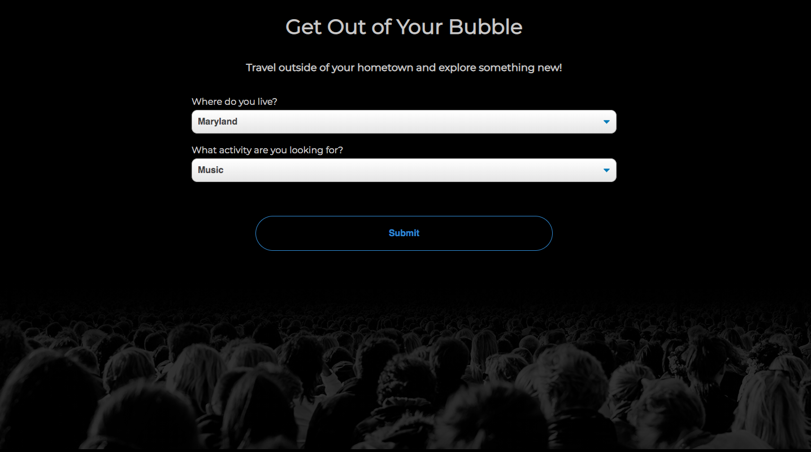

Get Out of Your Bubble

Live App: https://george-arnold.github.io/get-out-of-your-bubble-api-project/

I live in Annapolis, MD. Here, like many other self-contained towns, everything you really need is within a 2-3 mile radius of home. It makes a "bubble" that people oftentimes never leave for anything beyond their 9-5. This app was made to encourage people to easily find places to go, and things to do, outside of their hometown. The user inputs where they live, what kind of event they're looking for, and the app presents them with a number of options. The user can click on those options for more information. 

Key technologies: 
-HTML/CSS/JavaScript/jQuery
-https://www.openbrewerydb.org/
-https://developer.ticketmaster.com/
